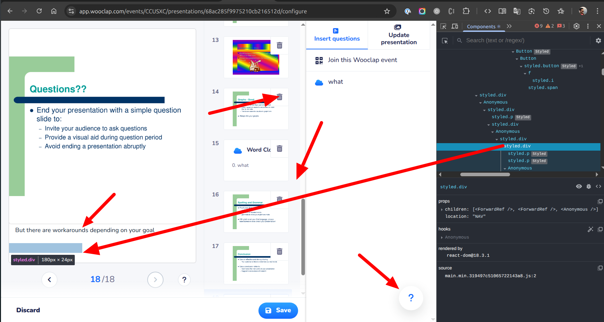

# Wooclap config page (Vite + React + TypeScript)

## Quickstart
`npm install && npm run dev`

## Summarize
- I would estimate this sort of Ticket as easy-to-go
- Overall I spent 1 hour for setting up, 1 hour for reading a Ticket and playing with an original page and 4 hours for coding

## Task notes
- I found this task to be quite interesting. I had so many things to improve in my mind from the beginning
- I used LocalStorage for taking notes. It works well for the Task, but overall I would not recomend using such approach. It has a limited size and no async call model. Those factors may affect the application responsiveness and cause errors
- I added scroll effect for Slide previe sidebar pointing to the exact slide
- I did not use any lazy-loading technics for the Task but it is nice to have
- I did not optimize images but it is also nice to have
- I did not use any accessibility-friendly technics

## Original page improvements
> “Everyone loves free speech—until it’s about them.” 😅

- I would add a confirmation when User clicks on Trash button on a slide. It is easy to remove, but for undo User has to Discard everything
- I would add scroll into view for an active Slide on the right sidebar
- I would move SpeakerNotes textarea right below the Slide - it looks closed to PoverPoint or GoogleSlides way
- I would make help button smaller, on MD- screens it overlaps with important controls
- I would review the component tree for hidden (unused react elements). Not sure about that actually, see the screenshot - many hidden things right behind the page.